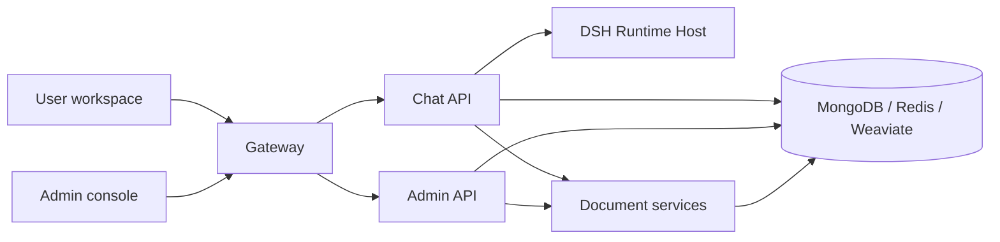

<p align="center">
  
</p>

<h1 align="center">MOVO Community Edition</h1>

<p align="center">
  A self-hosted enterprise Agent platform built on DeepSeek Harness (DSH).
</p>

<p align="center">
  <strong>English</strong> · <a href="README.zh-CN.md">简体中文</a>
</p>

<p align="center">
  <a href="https://www.himovo.com/en/">Official website</a> ·
  <a href="https://www.himovo.com/en/guide/introduction.html">Documentation</a> ·
  <a href="https://www.himovo.com/en/guide/getting-started.html">Quick start</a>
</p>

MOVO brings DSH Agents from development experiments into enterprise production. It combines the DSH Runtime, Skills, Tools and MCP ecosystem with a deployable user workspace, enterprise knowledge, identity and access control, administration, governance and file delivery.

> **In one sentence:** DSH runs the Agent; MOVO brings the Agent into enterprise production.

This repository contains the self-hosted Community Edition and is the shared source foundation used by MOVO cloud and future enterprise distributions.

## Why MOVO

Running an Agent demo is very different from operating an Agent platform for a team. MOVO provides the product and infrastructure layer around DSH so you can move into real use without assembling authentication, knowledge, administration, governance and delivery systems yourself.

- **Stay native to DSH.** Use the official DSH Runtime, Skills, Tools, MCP integrations and sub-agent capabilities instead of adopting a disconnected proprietary runtime.
- **Deploy a complete product.** Start the user workspace, admin console, APIs, document processing, retrieval and infrastructure together with Docker Compose.
- **Keep control of models and data.** Connect your own model providers and keep application data, knowledge and runtime services in your deployment.
- **Serve users as well as developers.** Give employees a usable workspace while administrators manage accounts, models, knowledge, capabilities, quotas and audit records.
- **Grow without rebuilding the foundation.** Begin with the self-hosted Community Edition and retain the same shared source foundation as deployment requirements expand.

If you only need a low-level Agent runtime, DSH may be enough. Choose MOVO when you need to turn that runtime into a deployable, manageable product for real users.

## What MOVO provides

| Capability | What you can do |
| --- | --- |
| DSH-native Agent runtime | Use planning, tool calls, Skills, sub-agents and governed execution through the bundled DSH Runtime Host. |
| Enterprise knowledge and research | Search internal documents and public sources, run multi-round research, retain citations and inspect supporting evidence. |
| Document and multimodal intelligence | Parse PDF, DOCX, XLSX, PPTX, CSV and Markdown files, including images, charts and other visual content. |
| Content and file generation | Create reports, articles, editable presentations, spreadsheets, PDFs and Markdown deliverables. |
| Skills, Tools and MCP | Reuse workflows and connect HTTP or MCP services to business systems. |
| Automation and governance | Schedule tasks, require approval for sensitive tool actions, trace executions and retain generated artifacts. |
| Enterprise administration | Manage organizations, users, roles, models, knowledge, Skills, Tools, audit records and runtime health. |

Typical use cases include enterprise knowledge Q&A, policy and project-material retrieval, multi-source research, competitive analysis, report and presentation generation, spreadsheet processing, translation, template filling and controlled system integration.

## Community Edition

A tenant created by the self-hosted setup flow is marked as `community`:

- no member-count limit;
- billing and commercial plan enforcement are disabled;
- self-managed model connections are enabled;
- data and runtime services remain in your own deployment.

The repository includes the Web user workspace, administration console, conversation and Agent APIs, DSH Runtime Host, document parser and retrieval services, and Docker deployment configuration.

### Browser Agent and Code Agent

The self-hosted Web workspace supports chat, research, knowledge, files and content generation. To use **Browser Agent** or **Code Agent**, install [MOVO Desktop](https://www.himovo.com/en/download.html) and connect it to your self-hosted MOVO service.

MOVO Desktop provides the local browser session, code workspace, project terminal and Git integration required by these capabilities. It is distributed separately as proprietary software; its source code is not included in this repository and is not part of the Community Edition source release.

## Architecture



The default Docker Compose deployment starts 12 services: the gateway, two Web applications, three application APIs, the DSH Runtime Host, a document worker, MongoDB, Redis, Weaviate and a one-time secret bootstrap service.

## Quick start with Docker

### Requirements

- Git
- Docker Desktop, or Docker Engine with Docker Compose v2
- at least 8 GB of available memory

Clone MOVO and start it with the prebuilt images:

```bash
git clone https://github.com/himovo/movo.git
cd movo
chmod +x movo
./movo up
```

`./movo up` pulls the published MOVO images, starts the complete stack, waits for health checks and prints the first-run setup address. Normal users do **not** need to build the images locally.

Open:

```text
http://localhost:3000/admin/setup
```

The setup wizard checks the deployment and guides you through creating the organization and initial accounts, connecting a default chat model, and optionally configuring embedding, reranking, vision, image generation and Web search providers. Provider credentials are encrypted before storage.

After setup:

| Entry | Default URL | Purpose |
| --- | --- | --- |
| User workspace | `http://localhost:3000/` | Conversations, research, knowledge, files and content generation |
| Admin console | `http://localhost:3000/admin/` | Users, models, knowledge, Skills, Tools and governance |
| Setup wizard | `http://localhost:3000/admin/setup` | First-run initialization only |

### Common operations

```bash
./movo status
./movo logs chat-api
./movo restart
./movo update
./movo backup /path/on/a/large-disk/movo-backup
./movo down       # Stop containers and preserve data
./movo down -v    # Permanently delete MOVO data after confirmation
```

For production, pin a release tag instead of using `latest`. See [Docker deployment](docs/docker-deployment.md) for image selection, upgrades, backup and restore, reverse proxy configuration and the production baseline.

### Configuration

The default local deployment does not require an `.env` file. To change the public port, canonical URL, image version or volume prefix:

```bash
cp .env.example .env
```

```env
MOVO_PORT=3000
MOVO_VOLUME_PREFIX=movo
MOVO_IMAGE_PREFIX=ghcr.io/himovo/movo
MOVO_VERSION=vX.Y.Z
PUBLIC_BASE_URL=https://movo.example.com
```

Keep `MOVO_VOLUME_PREFIX` stable after first startup. DNS, TLS certificates and the external reverse proxy remain the deployment operator's responsibility.

## Build from source

Building locally is intended for contributors and developers. Build and start
the source tree with:

```bash
./movo up --build
```

To build the images without starting the services:

```bash
./movo build
```

Source builds download Playwright, LibreOffice, Docling and model assets, so they need substantially more time and disk space than the prebuilt-image path.

## Repository layout

| Path | Component |
| --- | --- |
| `apps/user-web/` | Vue 3 user workspace |
| `apps/admin-web/` | Vue 3 setup and administration console |
| `services/chat-api/` | FastAPI conversation, task, Agent, Skill and DSH gateway |
| `services/chat-api/dsh/runtime-host/` | Node.js DSH Runtime Host |
| `services/admin-api/` | FastAPI organization, user, model and platform management API |
| `services/document-parser/` | Document parsing, preview, retrieval API and worker |
| `deploy/` | Bootstrap and gateway configuration |

## Contributing and support

- [Contribution guide](CONTRIBUTING.md)
- [Security policy](SECURITY.md)
- [Community support policy](SUPPORT.md)
- [Maintainer release process](docs/release-process.md)
- Security, commercial licensing and support: `support@himovo.com`

Before submitting a change, run the relevant checks described in [CONTRIBUTING.md](CONTRIBUTING.md). At minimum, the repository hygiene check is:

```bash
python3 scripts/check_open_source_hygiene.py
```

## License

MOVO is source-available under the [MOVO Community License](LICENSE), based on Apache License 2.0 with additional conditions. Without written authorization, the license does not permit operating a hosted multi-tenant SaaS offering or removing or modifying the MOVO logo and copyright notices in the included frontends.

These additional restrictions mean that the MOVO Community License is not the unmodified Apache License 2.0 and should not be represented as an OSI-approved open-source license. For commercial licensing, multi-tenant SaaS authorization or alternative branding rights, contact `support@himovo.com`.
