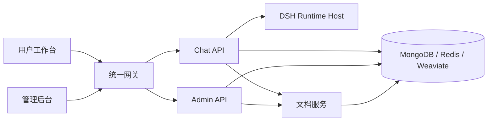

<p align="center">
  
</p>

<h1 align="center">MOVO 社区版</h1>

<p align="center">
  基于 DeepSeek Harness（DSH）构建的可私有化部署企业 Agent 平台。
</p>

<p align="center">
  <a href="README.md">English</a> · <strong>简体中文</strong>
</p>

<p align="center">
  <a href="https://himovo.com/">官方网站</a> ·
  <a href="https://himovo.com/guide/introduction">产品文档</a> ·
  <a href="https://himovo.com/guide/getting-started">快速开始</a>
</p>

MOVO 帮助企业将 DSH Agent 从开发验证推进到生产使用。它在 DSH Runtime、Skill、工具和 MCP 生态之上，提供可部署的用户工作台、企业知识、身份与权限、管理治理和文件交付能力。

> **一句话理解 MOVO：** DSH 负责智能体如何运行，MOVO 负责智能体如何进入企业生产环境。

本仓库包含可私有化部署的 MOVO 社区版，也是 MOVO 云服务和未来企业版本共同依赖的源码基础。

## 为什么选择 MOVO

让 Agent 完成一次演示，与让一个 Agent 平台真正服务团队是两件事。MOVO 在 DSH 周围提供完整的产品与基础设施层，让你无需自行拼装身份、知识、管理、治理和交付系统，就能进入真实使用。

- **保持 DSH 原生。** 直接使用官方 DSH Runtime、Skill、工具、MCP 集成和子智能体能力，不引入割裂的私有运行时。
- **部署的是完整产品。** 通过 Docker Compose 一次启动用户工作台、管理后台、API、文档处理、检索和基础设施。
- **模型和数据由自己掌控。** 连接自己的模型服务，并将应用数据、企业知识和运行服务保留在自己的部署环境中。
- **同时服务员工和管理员。** 员工使用完整工作台，管理员统一管理账号、模型、知识、能力、配额和审计记录。
- **需求增长时无需重建基础。** 从可私有化部署的社区版起步，并在部署需求扩大时继续使用同一套共享源码基础。

如果你只需要底层 Agent Runtime，DSH 可能已经足够；当你需要把 Runtime 变成可部署、可管理、能服务真实用户的产品时，选择 MOVO。

## MOVO 提供什么

| 能力 | 可以完成的工作 |
| --- | --- |
| DSH 原生 Agent Runtime | 通过内置 DSH Runtime Host 使用任务规划、工具调用、Skill、子智能体和受控执行能力。 |
| 企业知识与研究 | 检索内部文档和公开信息，执行多轮研究，保留引用并查看支撑依据。 |
| 文档与多模态理解 | 解析 PDF、DOCX、XLSX、PPTX、CSV、Markdown，以及文档中的图片、图表等视觉内容。 |
| 内容与文件生成 | 生成报告、文章、可编辑 PPT、电子表格、PDF 和 Markdown 等交付成果。 |
| Skill、工具与 MCP | 复用工作流，通过 HTTP 或 MCP 服务连接企业业务系统。 |
| 自动化与治理 | 创建定时任务，对敏感工具操作进行审批，追踪执行过程并留存产物。 |
| 企业管理后台 | 管理组织、用户、角色、模型、知识、Skill、工具、审计记录和运行状态。 |

典型场景包括企业知识问答、制度与项目资料检索、多源研究、竞品分析、报告和 PPT 生成、表格处理、翻译、模板填充，以及受控的业务系统集成。

## 社区版说明

通过私有化初始化流程创建的租户会被标记为 `community`：

- 不限制成员数量；
- 不启用计费和商业套餐限制；
- 支持自行配置模型服务；
- 数据和运行服务保留在部署者自己的环境中。

本仓库包括用户工作台、管理后台、对话与 Agent API、DSH Runtime Host、文档解析与检索服务，以及完整的 Docker 部署配置。

### 浏览器 Agent 与 Code Agent

私有化部署的 Web 工作台支持对话、研究、知识、文件和内容生成。如需使用**浏览器 Agent** 或 **Code Agent**，请下载安装 [MOVO Desktop](https://himovo.com/download)，并将它连接到你自行部署的 MOVO 服务。

MOVO Desktop 为这些能力提供本地浏览器会话、代码工作区、项目终端和 Git 集成。该桌面客户端是独立分发的专有软件，源码不包含在本仓库中，也不属于社区版源码发布范围。

## 系统架构



默认 Docker Compose 部署会启动 12 个服务：统一网关、两个 Web 应用、三个应用 API、DSH Runtime Host、文档 Worker、MongoDB、Redis、Weaviate，以及一次性的密钥初始化服务。

## 使用 Docker 快速开始

### 环境要求

- Git
- Docker Desktop，或 Docker Engine 与 Docker Compose v2
- 至少 8 GB 可用内存

克隆 MOVO，并直接使用官方预构建镜像启动：

```bash
git clone https://github.com/himovo/movo.git
cd movo
chmod +x movo
./movo --lang zh-CN up
```

`./movo up` 会拉取已发布的 MOVO 镜像、启动完整服务、等待健康检查，并输出首次初始化地址。普通用户**不需要在本地构建镜像**。

打开：

```text
http://localhost:3000/admin/setup
```

初始化向导会检查部署状态，并引导你创建组织和初始账号、连接默认对话模型；还可以按需配置 Embedding、Rerank、Vision、图片生成和联网搜索服务。供应商凭证会加密后存储。

初始化完成后：

| 入口 | 默认地址 | 用途 |
| --- | --- | --- |
| 用户工作台 | `http://localhost:3000/` | 对话、研究、知识、文件和内容生成 |
| 管理后台 | `http://localhost:3000/admin/` | 用户、模型、知识、Skill、工具和治理配置 |
| 初始化向导 | `http://localhost:3000/admin/setup` | 仅用于首次初始化 |

### 常用运维命令

```bash
./movo status
./movo logs chat-api
./movo restart
./movo update
./movo backup /path/on/a/large-disk/movo-backup
./movo down       # 停止容器并保留数据
./movo down -v    # 确认后永久删除 MOVO 数据
```

生产部署应固定版本标签，不要直接使用 `latest`。镜像选择、升级、备份恢复、反向代理和生产基线详见 [Docker 部署说明](docs/docker-deployment.md)。

### 配置

默认本地部署不需要创建 `.env` 文件。如需修改公开端口、访问地址、镜像版本或数据卷前缀：

```bash
cp .env.example .env
```

```env
MOVO_PORT=3000
MOVO_VOLUME_PREFIX=movo
MOVO_IMAGE_PREFIX=ghcr.io/himovo/movo
MOVO_VERSION=vX.Y.Z
PUBLIC_BASE_URL=https://movo.example.com
```

首次启动后应保持 `MOVO_VOLUME_PREFIX` 不变。DNS、TLS 证书和外部反向代理由部署者负责配置。

## 从源码构建

本地构建主要面向贡献者和开发人员。使用下面的命令从源码构建并启动：

```bash
./movo up --build
```

如果只构建镜像但不启动服务：

```bash
./movo build
```

源码构建需要下载 Playwright、LibreOffice、Docling 和模型资源，因此会比使用预构建镜像消耗更多时间和磁盘空间。

## 仓库结构

| 路径 | 组件 |
| --- | --- |
| `apps/user-web/` | Vue 3 用户工作台 |
| `apps/admin-web/` | Vue 3 初始化与管理后台 |
| `services/chat-api/` | FastAPI 对话、任务、Agent、Skill 和 DSH 网关 |
| `services/chat-api/dsh/runtime-host/` | Node.js DSH Runtime Host |
| `services/admin-api/` | FastAPI 组织、用户、模型和平台管理 API |
| `services/document-parser/` | 文档解析、预览、检索 API 和 Worker |
| `deploy/` | 初始化与统一网关配置 |

## 参与贡献与支持

- [贡献指南](CONTRIBUTING.md)
- [安全策略](SECURITY.md)
- [社区支持策略](SUPPORT.md)
- [维护者发布流程](docs/release-process.md)
- 安全问题、商业授权与支持：`support@himovo.com`

提交改动前，请按 [CONTRIBUTING.md](CONTRIBUTING.md) 运行对应检查。至少应执行仓库开源卫生检查：

```bash
python3 scripts/check_open_source_hygiene.py
```

## 许可证

MOVO 依据 [MOVO Community License](LICENSE) 提供源码。该许可证以 Apache License 2.0 为基础并附加了额外条件：未经书面授权，不允许将 MOVO 作为托管式多租户 SaaS 服务运营，也不允许移除或修改所含前端中的 MOVO Logo 与版权声明。

由于存在这些附加限制，MOVO Community License 并非未经修改的 Apache License 2.0，也不应被描述为 OSI 认可的开源许可证。如需商业授权、多租户 SaaS 授权或替换品牌，请联系 `support@himovo.com`。
